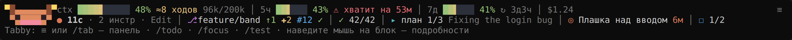
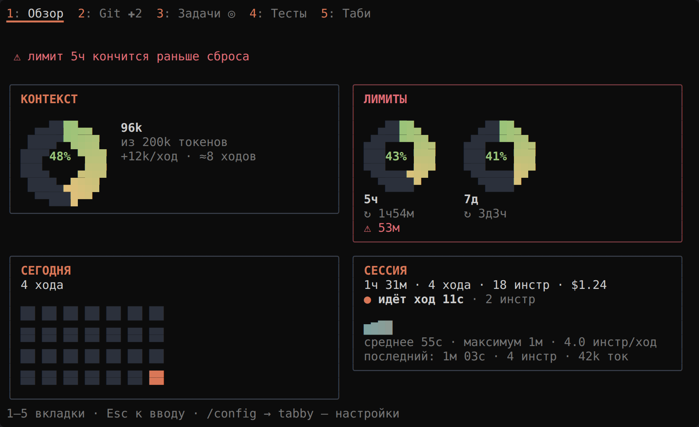
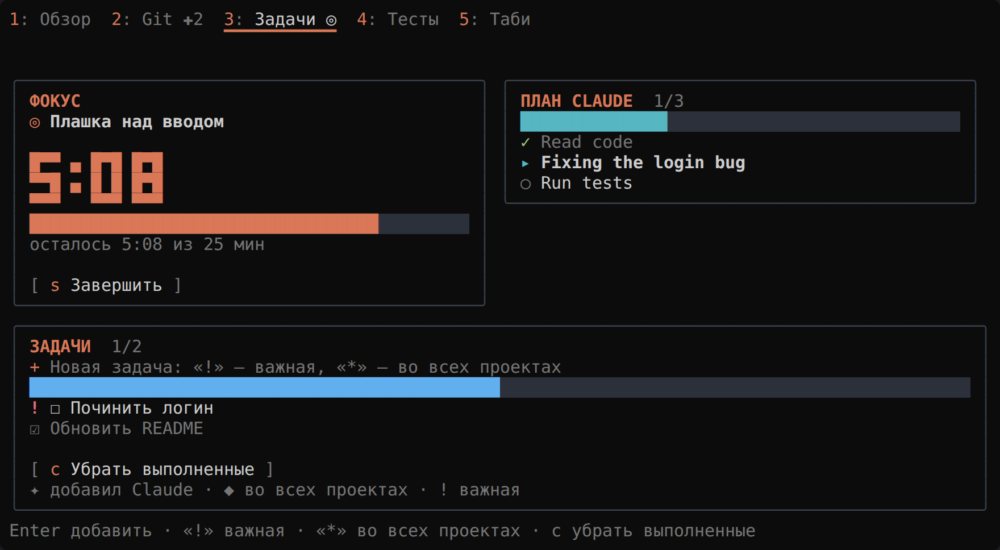
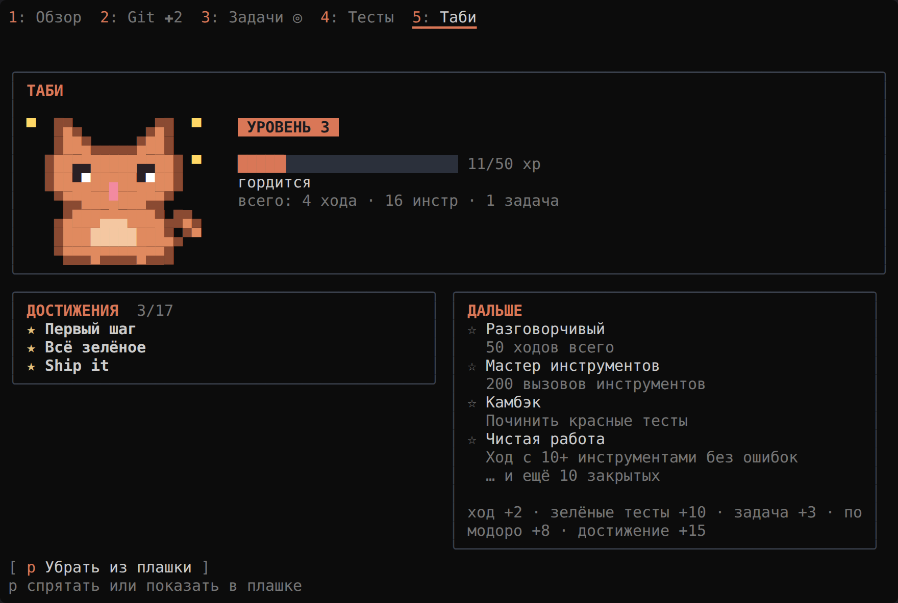

# Tabby: приборная панель для Claude Code

Мод для Claude Code: две строки над полем ввода, панель-дашборд с пятью вкладками
и живой пиксельный кот Таби, который моргает, виляет хвостом и «печатает», пока Claude работает.



| Обзор | Задачи и фокус | Таби |
| --- | --- | --- |
|  |  |  |

*Превью отрисованы из тех же деревьев элементов, что получает терминал. Шрифт и отступы
в вашем терминале будут немного другими.*

**Первая строка — сессия.**
- Контекст: плавная градиентная полоса и прогноз, на сколько ходов его хватит при текущем темпе.
- Лимиты 5ч и 7д: время до сброса или `⚠ хватит на 39м`, если при таком темпе лимит кончится раньше сброса.
- Стоимость сессии.

**Вторая строка — работа.**
- Ход: живой таймер или итог прошлого хода.
- Git: ветка, PR и статус его проверок CI.
- Тесты.
- План Claude (его TodoWrite).
- Фокус-помодоро.
- Мини-TODO.

**Пиксель-арт.** Кот, кольцевые датчики, тепловая карта и большие цифры таймера нарисованы
полублоками `▀`: два квадратных пикселя на клетку. Это работает в любом терминале с truecolor,
включая Windows Terminal. Анимация перерисовывает только клетки кота примерно 8 раз в секунду
и останавливается, когда кота нет на экране. Её можно выключить: `/config` → tabby →
Animate Tabby. В десктопном приложении, VS Code и на телефоне те же картинки рисуются в SVG:
кот (анимация играет сама), кольца, тепловая карта и часы фокуса.

## Как с ней работать

- **Наведите мышь на любой блок:** поверх соседней строки появится карточка с деталями. Например, для лимита: «Лимит 5ч: 47% · сброс в 14:14 (через 2ч 14м) · темп 18%/ч · закончится через 39м, раньше сброса».
- **Кликните по подписи блока:** откроется его вкладка. Клик по `✗ 2 упало` впишет в поле ввода просьбу к Claude починить упавшие тесты (со списком), клик по `✓ 42/42` перезапустит тесты.
- **Узкое окно:** менее важные блоки уходят первыми, строки не переносятся. `/tab compact` сворачивает плашку в одну строку.
- **Цвет:** зелёный — норма, жёлтый — с 60%, красный — с 85%.

Карточки и клики работают там, где терминал передаёт мышь (полноэкранный режим) и в десктопном приложении.

## Панель

Открывается командой `/tab` или кнопкой `≡`. `1`–`5` — вкладки, `Esc` — обратно к вводу. На вкладках видны значки того, что требует внимания (`Git ✚2`, `Тесты ✗`), внизу каждой — подсказка по клавишам.

| Вкладка | Что внутри |
| --- | --- |
| **Обзор** | Строка «Сейчас», кольцо контекста с прогнозом, кольца лимитов со сбросом и темпом, «Сегодня» с серией дней и тепловой картой за 4 недели, сессия с историей ходов |
| **Git** | Ветка, PR с проверками и ссылкой, изменённые файлы, поле коммита (Enter — `git add -A` и commit), Stash с подтверждением повторным нажатием (`s`), обновление (`r`) |
| **Задачи** | Помодоро с большими пиксельными цифрами и полосой, план Claude по шагам, ваш список: `!` — важная, `*` — во всех проектах, клик отмечает, `c` убирает выполненные |
| **Тесты** | Кольцо доли прошедших (красный остаток — упавшие), история прогонов, список упавших тестов (клик — попросить Claude починить этот), кнопка «починить все» (`f`), хвост вывода |
| **Таби** | Большой анимированный пиксельный кот, уровень и опыт, серия дней, открытые достижения и ближайшие цели |

## Команды

| Команда | Что делает |
| --- | --- |
| `/tab [overview\|git\|tasks\|tests\|pet]` | Открыть панель на вкладке |
| `/tab compact` · `/tab hide-pet` | Плашка в одну строку · спрятать кота |
| `/focus <цель> [минуты]` | Помодоро; `0` — без таймера; `/focus stop` — завершить |
| `/todo <текст>` | Добавить задачу: `/todo !срочно`, `/todo *во всех проектах` |
| `/todo done N` · `/todo rm N` | Отметить · удалить |
| `/test [команда]` | Запустить тесты (команда определяется сама, своя запоминается для проекта) |

Все команды работают и во время ответа Claude.

## Настройки: `/config` → tabby

| Настройка | По умолчанию | Что меняет |
| --- | --- | --- |
| Language / Язык | `ru` | Язык интерфейса: `ru` или `en` |
| Animate Tabby | вкл. | Анимация пиксельного кота |
| Palette | `dark` | Цвета для тёмного или светлого терминала |
| Pomodoro minutes | 25 | Длина помодоро |
| Context warning, % | 80 | С какого заполнения предупреждать о контексте |
| Rate-limit warning, % | 80 | С какого расхода предупреждать о лимитах |
| Run tests after Claude edits | выкл. | После хода с правками, где Claude не запускал тесты, запустить их |
| Sound | вкл. | Мягкий сигнал, когда закончился долгий ход или помодоро |
| Quiet mode | выкл. | Только важные уведомления |
| Show cost | вкл. | Показывать стоимость |

## Что видит Claude

- **Инструмент `mcp__tabby__todo`.** Claude читает ваш список, добавляет пункты (в том числе важные и общие для всех проектов) и отмечает выполненные. Его пункты помечены `✦`.
- **Цель фокуса и открытые задачи.** Они коротко прикладываются к вашему сообщению, только когда изменились. Системный промпт не трогается, кеш промпта не сбрасывается.
- **Тесты, запущенные самим Claude.** Если Claude запускает тесты через Bash, результат тоже попадает в плашку. После `git push` и `gh pr` статус PR обновляется сразу.

## Таби

Настроение кота отражает сессию: мурлычет (глаза-улыбки `^ ^`, иногда сердечко), во время хода печатает за ноутбуком, грустит при красных тестах, сосредоточен в фокусе, спит после 15 минут простоя, гордится новым достижением. Опыт копится за ходы, зелёные тесты, закрытые задачи, помодоро и 17 достижений. Прогресс, статистика по дням и серия дней подряд сохраняются между сессиями.

## Установка

**Вариант 1 — плагином.** Работает после слияния в `main`:
```bash
claude plugin marketplace add alexskvo10/claude-tab
claude plugin install tabby@tabby
```

**Вариант 2 — из папки:**
```bash
git clone https://github.com/alexskvo10/claude-tab ~/claude-tab
claude --plugin-dir ~/claude-tab
```
Чтобы мод загружался всегда, добавьте в `~/.claude/settings.json`:
```json
{ "env": { "CLAUDE_CODE_PLUGIN_DIRS": "/полный/путь/к/claude-tab" } }
```
Обновление: `git pull` в папке мода и перезапуск `claude`.

Нужна сборка Claude Code 2.1.289 или новее (function hooks, early access).
Для PR и CI нужен установленный и авторизованный `gh`; без него вкладка Git работает, только без PR.

**Учтите:** коммит из панели выполняется с отключёнными git-хуками репозитория (так движок запускает git), поэтому pre-commit-проверки при нём не сработают.

## Разработка

```bash
claude plugin validate .   # манифест и модуль хуков глазами движка
claude plugin test .       # 64 теста: утилиты, плашка, панель, команды, настройки
tsc -p .                   # после первой загрузки движок кладёт типы в .claude-plugin/types/
```

```
hooks/register.tsx   хуки, команды, инструмент, настройки; единственное место, где есть `$`
hooks/actions.ts     логика: лимиты, ходы, git и PR, тесты, задачи, фокус, кот, статистика
hooks/ui/            плашка (с карточками) и панель — чистые функции от снимка состояния
hooks/lib/           форматирование, прогнозы, git, тесты, статистика, RU/EN,
                     pixels.ts (полублоки, кольца, цифры), sprites.ts (кот), anim.ts (кадры)
assets/chime.wav     сигнал
types/index.d.ts     контракт состояния ($.state)
tests/               тесты для `claude plugin test`
```
