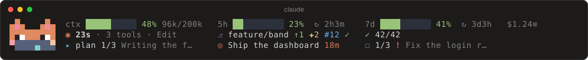
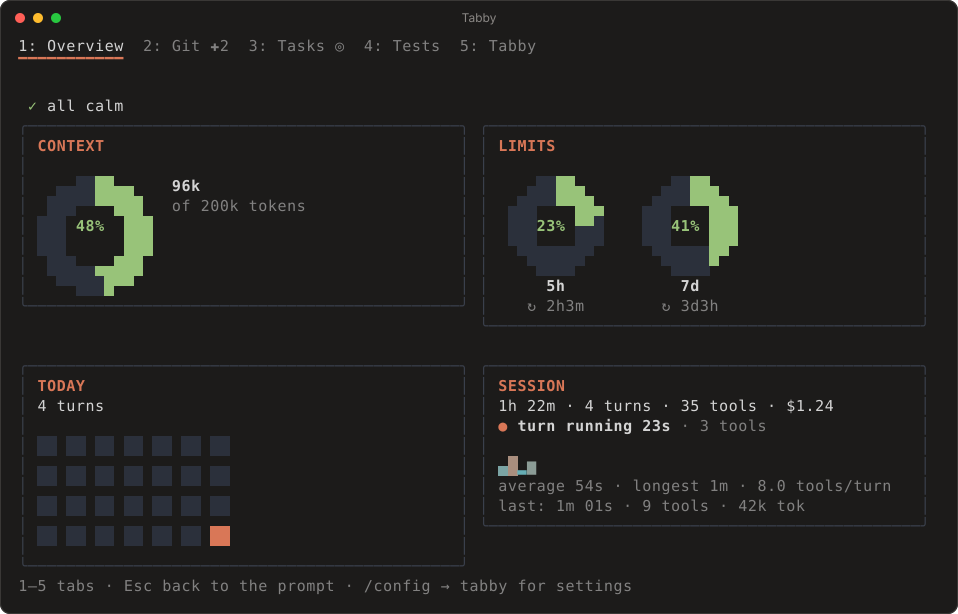
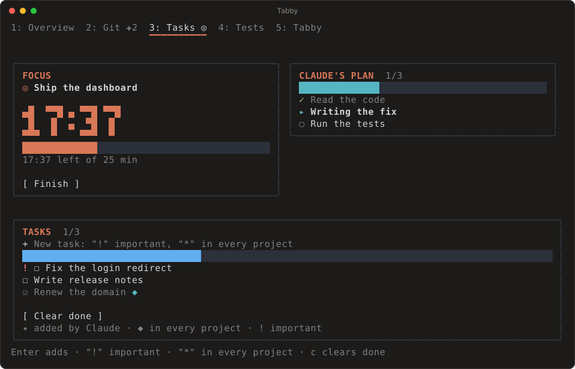
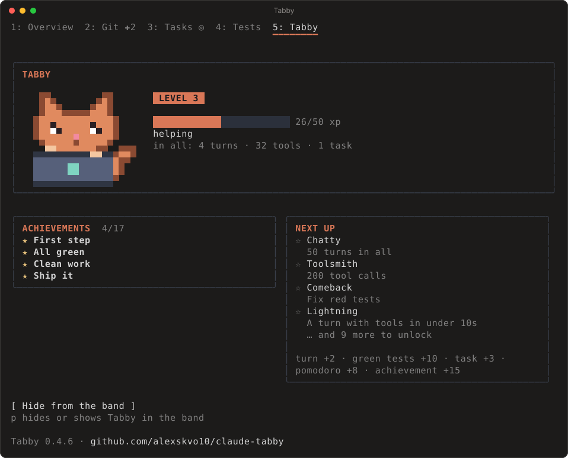

<div align="center">



# Tabby

**Спокойная приборная панель над полем ввода Claude Code — и пиксельный кот, который составит компанию.**

Контекст и лимиты с прогнозами · git и проверки PR · тесты · фокус-таймер · список задач, который видит Claude

<p>
  
  
  
  
</p>

[English](README.md) · **Русский**



</div>

> [!IMPORTANT]
> Tabby работает на **function hooks** Claude Code, а они пока в раннем доступе. Подходит Claude Code **2.1.285 (stable) и новее**; **рекомендуется 2.1.289 и новее**. Более старые сборки не проверялись.

## Почему Tabby

Не нужно спрашивать Claude Code, сколько места осталось. Tabby держит важные цифры в двух тихих строках над полем ввода: насколько заполнен контекст, когда сбросятся лимиты, зелёные ли тесты и что вы собирались сделать. Один взгляд — и обратно к работе.

- **Всё в одном месте.** Контекст, лимиты, git и проверки PR, тесты, план Claude, фокус-таймер, ваш список задач и питомец — в одной плашке и одной панели. Не нужно собирать скрипт строки состояния, монитор расхода и отдельный плагин с питомцем.
- **Внутри Claude Code, и живое.** Не строка текста: наведите мышь на блок — появятся подробности, кликните — откроется его вкладка, кликните по упавшему тесту — Claude получит просьбу его починить.
- **Claude тоже видит ваш список.** Ему известны цель фокуса и открытые задачи, он сам добавляет и отмечает пункты своим инструментом, а кеш промпта не сбрасывается.
- **Смотрит вперёд.** На сколько ходов хватит контекста при нынешнем темпе и доживёт ли лимит до сброса.
- **Одни лимиты во всех чатах.** Чат узнаёт о лимитах только из своих ответов; Tabby делит самые свежие цифры, поэтому в тихом чате они не устаревают.
- **Терминал и десктопное приложение.** Одна и та же плашка и панель, пиксельный кот везде.
- **Ничего не уходит с компьютера.** Ни зависимостей, ни собственных сетевых запросов, кроме `gh`; [вот всё, чего он касается](#что-tabby-делает-на-вашем-компьютере).

## Как это выглядит

<table>
  <tr>
    <td width="33%"></td>
    <td width="33%"></td>
    <td width="33%"></td>
  </tr>
  <tr>
    <td align="center"><b>Обзор</b><br><sub>кольца контекста и лимитов, сегодня, сессия</sub></td>
    <td align="center"><b>Задачи</b><br><sub>часы фокуса, план Claude, ваш список</sub></td>
    <td align="center"><b>Табби</b><br><sub>кот, уровень и достижения</sub></td>
  </tr>
</table>

<sub>Картинки нарисованы из тех же деревьев элементов, что получает терминал; шрифт и отступы у вас будут немного другими. Интерфейс на картинках английский, в настройках есть русский.</sub>

## Плашка

В терминале блоки стоят в колонках, поэтому плашка читается как маленькая таблица; десктопное приложение рисует её пропорциональным шрифтом, с промежутками между блоками и строками.

| Строка | Блоки |
| --- | --- |
| **Сессия** | **Контекст**: полоса, заполнение и на сколько ходов хватит при нынешнем темпе · **лимиты 5ч и 7д**: полоса и время до сброса · **стоимость** сессии |
| **Работа** | **Ход**: живой таймер с числом инструментов или итог прошлого · **git**: ветка, впереди/позади, изменения, PR и его проверки CI · **тесты** |
| **Задачи** | **План Claude** (его TodoWrite) · ваш **фокус** · ваш **список задач** |

- **Наведите мышь на блок** — появится карточка с подробностями, например «Лимит 5ч: 50% · сброс в 18:10 (через 1ч 37м) · темп 12%/ч · до сброса хватит».
- **Кликните по подписи** — откроется её вкладка. Клик по `✗ 2 упало` впишет в поле ввода просьбу к Claude починить именно эти тесты, клик по `✓ 42/42` перезапустит их.
- **Цвет** следует за заполнением: зелёный, жёлтый с 60 %, красный с 85 %.
- **Узкое окно?** Первыми уходят менее важные блоки, строки не переносятся. `/tab compact` сворачивает плашку в одну строку.
- **Во всех чатах одни лимиты.** Чат узнаёт о лимитах только из своих ответов, поэтому Tabby делит самые свежие цифры между всеми вашими сессиями.

Карточки и клики работают там, где терминал передаёт мышь (полноэкранный режим), и в десктопном приложении.

## Панель

Открывается командой `/tab` или кнопкой `≡`. `1`–`5` переключают вкладки, `Esc` — обратно к вводу. На вкладках видны значки того, что требует внимания (`Git ✚2`, `Тесты ✗`).

| Вкладка | Что внутри |
| --- | --- |
| **Обзор** | Строка «Сейчас», кольцо контекста с прогнозом, кольца лимитов со сбросом и темпом, «Сегодня» с серией дней и тепловой картой за 4 недели, сессия с ходами |
| **Git** | Ветка, PR с проверками и ссылкой, изменённые файлы, поле коммита (`Enter` — добавить всё и закоммитить), stash с подтверждением повторным нажатием, обновление |
| **Задачи** | Помодоро с большими пиксельными цифрами, план Claude по шагам, ваш список: `!` — важная, `*` — во всех проектах, клик отмечает, `c` убирает выполненные |
| **Тесты** | Кольцо доли прошедших, история прогонов, упавшие тесты (клик — попросить Claude починить), «починить все», хвост вывода |
| **Табби** | Большой анимированный кот, уровень и опыт, серия дней, открытые достижения и ближайшие цели |

## Команды

| Команда | Что делает |
| --- | --- |
| `/tab [overview\|git\|tasks\|tests\|pet]` | Открыть панель на вкладке |
| `/tab compact` · `/tab hide-pet` | Плашка в одну строку · спрятать кота |
| `/focus <цель> [минуты]` | Помодоро; `0` — без таймера; `/focus stop` — завершить |
| `/todo <текст>` | Добавить задачу: `/todo !срочно`, `/todo *во всех проектах` |
| `/todo done N` · `/todo rm N` | Отметить · удалить |
| `/test [команда]` | Запустить тесты; команда определяется сама, своя запоминается для проекта |

Все команды работают и во время ответа Claude.

## Настройки

`/config` → **tabby**

| Настройка | По умолчанию | Что меняет |
| --- | --- | --- |
| Language | `en` | `en` или `ru` |
| Animate Tabby | вкл. | Анимация пиксельного кота |
| Palette | `dark` | Цвета для тёмного или светлого терминала |
| Pomodoro minutes | 25 | Длина помодоро |
| Context warning, % | 80 | С какого заполнения предупреждать о контексте |
| Rate-limit warning, % | 80 | С какого расхода предупреждать о лимитах |
| Run tests after Claude edits | выкл. | После хода с правками, где Claude не запускал тесты, запустить их |
| Sound | вкл. | Мягкий сигнал, когда закончился долгий ход или помодоро |
| Quiet mode | выкл. | Только важные уведомления |
| Show cost | вкл. | Показывать стоимость |

## Кот Табби

Настроение Табби следует за сессией: мурлычет с глазами-улыбками (иногда с сердечком), выглядывает из-за ноутбука и печатает, пока Claude работает, грустит при красных тестах, сосредоточен в фокусе, засыпает после 15 минут простоя и сияет от нового достижения. Опыт копится за ходы, зелёные тесты, закрытые задачи, помодоро и 17 достижений. Прогресс, статистика по дням и серия дней сохраняются между сессиями.

В терминале кот нарисован полублоками (`▀`), по два квадратных пикселя на клетку, в любом терминале с truecolor, включая Windows Terminal; перерисовываются только клетки кота, около восьми раз в секунду, и только пока он на экране. Десктопное приложение, VS Code и телефон получают те же картинки в SVG.

## Что видит Claude

- **Инструмент `mcp__tabby__todo`.** Claude читает ваш список, добавляет пункты (в том числе важные и общие для всех проектов) и отмечает выполненные. Его пункты помечены `✦`.
- **Цель фокуса и открытые задачи** коротко прикладываются к вашему сообщению, только когда изменились. Системный промпт не трогается, кеш промпта не сбрасывается.
- **Тесты, запущенные самим Claude.** Если Claude запускает тесты через Bash, результат попадает в плашку. После `git push` и `gh pr` статус PR обновляется сразу.

## Что Tabby делает на вашем компьютере

Tabby выполняет код внутри вашей сессии Claude Code, поэтому вот всё, чего он касается:

- **Запускает** `git` (статус, лог, коммит, stash), `gh` (PR и проверки, если установлен и авторизован) и тестовую команду проекта.
- **Коммитит из панели с выключенными git-хуками репозитория**, потому что так движок запускает git. Pre-commit-проверки при таком коммите не сработают.
- **Пишет** своё хранилище (прогресс, статистику, настройки, ваш список) в папке настроек Claude Code и файл `~/.claude/tabby-limits.json` — показания лимитов, общие для ваших чатов.
- **Никуда ничего не отправляет.** Собственных сетевых запросов, кроме `gh`, нет.

## Установка

**Плагином**

```bash
claude plugin marketplace add alexskvo10/claude-tabby
claude plugin install tabby@tabby
```

**Из папки**

```bash
git clone https://github.com/alexskvo10/claude-tabby ~/claude-tabby
claude --plugin-dir ~/claude-tabby
```

Чтобы плагин загружался всегда, добавьте в `~/.claude/settings.json`:

```json
{ "env": { "CLAUDE_CODE_PLUGIN_DIRS": "/полный/путь/к/claude-tabby" } }
```

**Обновления.** Плагины из сторонних маркетплейсов Claude Code обновляет сам, только если один раз это включить: `/plugin` → **Marketplaces** → **tabby** → **Enable auto-update**. Тогда новые версии скачиваются в фоне и применяются при следующем запуске. Вручную: `claude plugin update tabby@tabby` и перезапуск.

Если плагин установлен из папки — `git pull` в ней и перезапуск `claude`. Десктопное приложение закройте полностью (вместе со значком в трее), чтобы оно перечитало код.

Для статуса PR и проверок нужен установленный и авторизованный [`gh`](https://cli.github.com). Без него вкладка Git работает, только без PR.

## Разработка

```bash
claude plugin validate .   # манифест и модуль хуков глазами движка
claude plugin test .       # 72 теста: утилиты, плашка, панель, команды, настройки
tsc -p .                   # после первой загрузки движок кладёт типы в .claude-plugin/types/
```

```
hooks/register.tsx   хуки, команды, инструмент, настройки; единственное место, где есть `$`
hooks/actions.ts     логика: лимиты, ходы, git и PR, тесты, задачи, фокус, кот, статистика
hooks/ui/            плашка (с карточками) и панель — чистые функции от снимка состояния
hooks/lib/           форматирование, прогнозы, git, тесты, статистика, i18n (en/ru),
                     pixels.ts (полублоки, кольца, цифры), sprites.ts (кот), anim.ts (кадры)
assets/chime.wav     сигнал
types/index.d.ts     контракт состояния ($.state)
tests/               тесты для `claude plugin test`
```

## Лицензия

[MIT](LICENSE). Tabby — независимый плагин сообщества. Он не создан, не одобрен и не поддерживается Anthropic.
